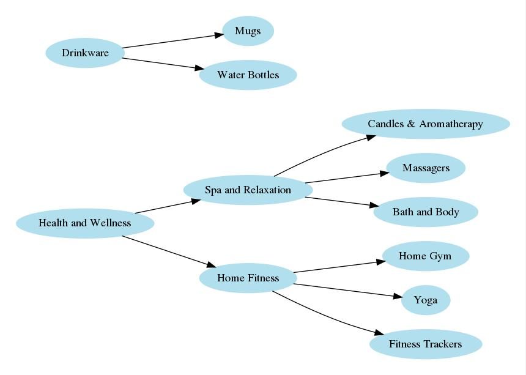

# The package allows to visually preview your nestedset graph.

[](https://packagist.org/packages/migda/laravel-nestedset-visualisation)
[](https://github.com/migda/laravel-nestedset-visualisation/actions?query=workflow%3Arun-tests+branch%3Amain)
[](https://github.com/migda/laravel-nestedset-visualisation/actions?query=workflow%3A"Check+%26+fix+styling"+branch%3Amain)
[](https://packagist.org/packages/migda/laravel-nestedset-visualisation)

Extension for [Laravel Nestedset](https://github.com/lazychaser/laravel-nestedset).

## Installation

You can install the package via composer:

```bash
composer require migda/laravel-nestedset-visualisation
```

## Usage

An artisan command for generating an image of a given graph is included.

It accepts the fully qualified name of the model as an argument, eg. App\Models\Category

If you want to run this command, you need to have installed **dot** - Part of graphviz package ([http://www.graphviz.org/](http://www.graphviz.org/)).

```bash
php artisan laravel-nestedset:visualize {model? : Nestedset model} {property? : model property as node label} {--output=./graph.jpg} {--format=jpg} {--direction=TB} {--dot-path=/usr/local/bin/dot}
```
Example:

```bash
php artisan laravel-nestedset:visualize "\App\Models\Category" name --output=categories_graph.jpg --format=jpg --direction=LR
```
or just:

```bash
php artisan laravel-nestedset:visualize
```



## Testing

```bash
composer test
```

## Changelog

Please see [CHANGELOG](CHANGELOG.md) for more information on what has changed recently.

## Contributing

Please see [CONTRIBUTING](.github/CONTRIBUTING.md) for details.

## Security Vulnerabilities

Please review [our security policy](../../security/policy) on how to report security vulnerabilities.

## Credits

- [Rafal Migda](https://github.com/migda)
- [All Contributors](../../contributors)

## Inspired by

[Winzou State Machine service provider for Laravel](https://github.com/sebdesign/laravel-state-machine#visualize-command)

## License

The MIT License (MIT). Please see [License File](LICENSE.md) for more information.
